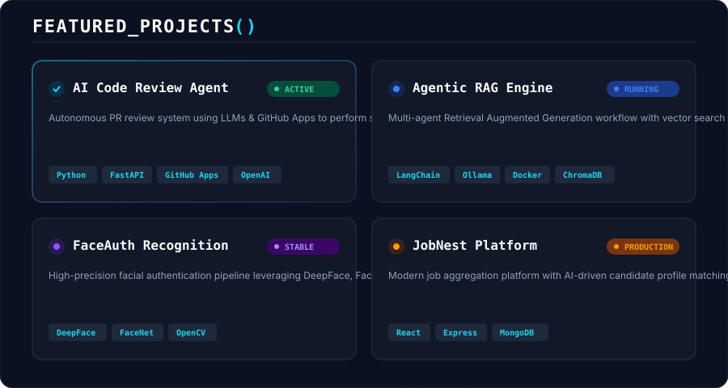
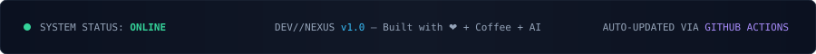

  <!-- Hero Banner: Theme-Aware SVG -->
  <picture>
    <source media="(prefers-color-scheme: dark)" srcset="hero-dark.svg">
    <source media="(prefers-color-scheme: light)" srcset="hero-light.svg">
    
  </picture>

 

<!-- Mission Control Section -->
<table width="100%" border="0" fill="#0B1120">
  <tr>
    <td bgcolor="#0B1120" style="padding: 20px; border-radius: 12px; border: 1px solid #1E293B;">
      

        

          
          <b fill="#F8FAFC">&nbsp;MISSION_CONTROL // INITIALIZATION</b>
        

        <pre font-family="JetBrains Mono, monospace" style="background-color: #111827; color: #F8FAFC; padding: 15px; border-radius: 8px; border: 1px solid #1E293B; line-height: 1.6;">
&gt; boot()
Initializing DEV//NEXUS...
Loading AI Modules....... Done
Loading GitHub Services.. Done
System Status............ ONLINE

&gt; whoami
Dev Bhardwaj | AI Engineer

&gt; mission
Building intelligent developer tools that augment software engineers using LLMs, Agentic AI &amp; scalable backend architectures.
        </pre>
      

    </td>
  </tr>
</table>

 

 

<!-- Featured Projects Section -->

  

 

 

<!-- Workspace Analytics -->

  <h3>⚡ WORKSPACE_ANALYTICS</h3>

  <table border="0" cellspacing="0" cellpadding="0">
    <tr>
      <td align="center" valign="middle">
        
      </td>
      <td align="center" valign="middle">
        
      </td>
    </tr>
  </table>

   

  <!-- GitHub Streak -->
  

 

<!-- Contribution Graph & Snake -->

  <h3>🐍 CONTRIBUTION_MATRIX</h3>

  <picture>
    <source media="(prefers-color-scheme: dark)" srcset="output/snake-dark.svg">
    <source media="(prefers-color-scheme: light)" srcset="output/snake-light.svg">
    
  </picture>

 

 

<!-- Current Stack Section (Terminal Style) -->
<table width="100%" border="0">
  <tr>
    <td bgcolor="#0B1120" style="padding: 20px; border-radius: 12px; border: 1px solid #1E293B;">
      

        

          🛠️ INSTALLED_MODULES // CURRENT STACK
        

        <table width="100%" border="0" style="font-family: 'JetBrains Mono', monospace; font-size: 13px; color: #F8FAFC;">
          <tr>
            <td width="33%" style="padding: 6px;">✓ <b>Python</b></td>
            <td width="33%" style="padding: 6px;">✓ <b>FastAPI</b></td>
            <td width="33%" style="padding: 6px;">✓ <b>LangChain</b></td>
          </tr>
          <tr>
            <td style="padding: 6px;">✓ <b>OpenAI</b></td>
            <td style="padding: 6px;">✓ <b>Gemini</b></td>
            <td style="padding: 6px;">✓ <b>Docker</b></td>
          </tr>
          <tr>
            <td style="padding: 6px;">✓ <b>GitHub Apps</b></td>
            <td style="padding: 6px;">✓ <b>MongoDB</b></td>
            <td style="padding: 6px;">✓ <b>PostgreSQL</b></td>
          </tr>
          <tr>
            <td style="padding: 6px;">✓ <b>React</b></td>
            <td style="padding: 6px;">✓ <b>PyTorch</b></td>
            <td style="padding: 6px;">✓ <b>OpenCV</b></td>
          </tr>
        </table>
      

    </td>
  </tr>
</table>

 

 

<!-- Connect Section -->

  <h3>📡 ESTABLISH_CONNECTION</h3>

  

    
    &nbsp;
    
    &nbsp;
    
    &nbsp;
    
    &nbsp;
    
  

 

<!-- Footer Section -->

  

