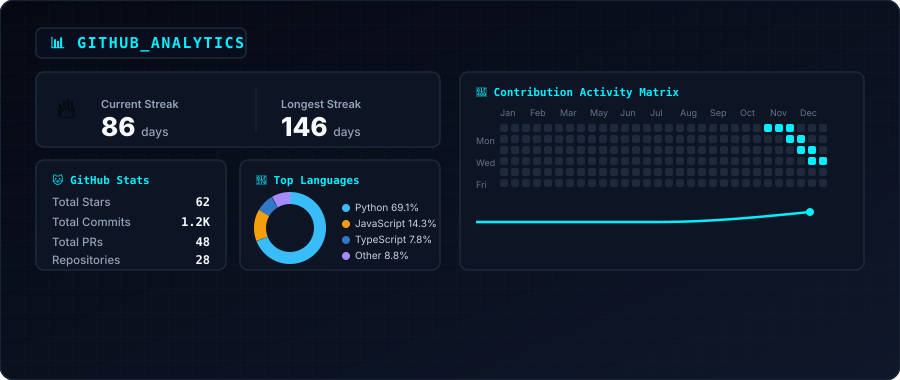

  <!-- Hero Header Banner -->
  <picture>
    <source media="(prefers-color-scheme: dark)" srcset="hero-dark.svg">
    <source media="(prefers-color-scheme: light)" srcset="hero-light.svg">
    
  </picture>

 

<!-- Featured Projects -->

  

 

<!-- GitHub Analytics -->

  

 

<!-- Installed Modules Stack & Work Experience -->

  

 

  

 

<!-- Connect -->

  <h3>🌐 LET'S CONNECT</h3>

  

    
    &nbsp;
    
    &nbsp;
    
    &nbsp;
    
    &nbsp;
    
  

 

<!-- Footer Bar -->

  

